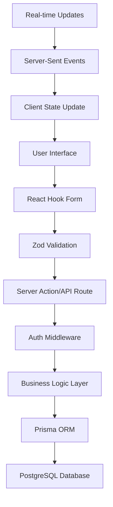

# Event Management Interface Design

## Overview

The Event Management Interface provides a comprehensive dashboard and form
system for creating, configuring, and managing events within the GameOne
platform. The design follows Next.js 15 App Router patterns with server-side
rendering, TypeScript strict mode, and integrates with the existing Prisma
database schema. The interface supports multi-language content (Czech/English),
real-time updates, and role-based access control.

## Architecture

### Frontend Architecture

- **Next.js App Router** - Server-side rendering with client-side interactivity
- **React Server Components** - For data fetching and initial rendering
- **Client Components** - For interactive forms and real-time updates
- **Shadcn/ui Components** - Consistent design system with Tailwind CSS
- **React Hook Form + Zod** - Form validation and state management
- **Next-intl** - Internationalization with server-side translation loading

### Backend Architecture

- **API Routes** - RESTful endpoints following `/api/events/*` pattern
- **Prisma ORM** - Type-safe database operations with transaction support
- **Kinde Auth** - Authentication and authorization middleware
- **Server Actions** - For form submissions and data mutations
- **Edge Runtime** - Optimized for serverless deployment

### Data Flow



## Components and Interfaces

### Core Components

#### EventManagementDashboard

```typescript
interface EventManagementDashboardProps {
  locale: string;
  user: User;
  initialEvents: Event[];
}
```

- Server component that fetches user's events
- Displays event list with status indicators
- Provides filtering and search functionality
- Handles pagination for large event lists

#### EventCreateForm

```typescript
interface EventCreateFormProps {
  locale: string;
  bankAccounts: BankAccount[];
  categories: EventCategory[];
}
```

- Multi-step form with validation
- Language tabs for Czech/English content
- Real-time slug generation
- Payment configuration section

#### EventEditForm

```typescript
interface EventEditFormProps {
  event: Event;
  locale: string;
  bankAccounts: BankAccount[];
  categories: EventCategory[];
  registrationCount: number;
}
```

- Pre-populated form with existing event data
- Validation for changes affecting existing registrations
- Capacity change warnings and confirmations

#### EventAnalyticsDashboard

```typescript
interface EventAnalyticsDashboardProps {
  event: Event;
  registrations: Registration[];
  payments: Payment[];
  waitingList: WaitingList[];
}
```

- Real-time registration statistics
- Payment tracking and revenue analytics
- Attendee demographics and engagement metrics

### API Interfaces

#### Event API Endpoints

**POST /api/events**

```typescript
interface CreateEventRequest {
  title: string;
  description?: string;
  shortDescription?: string;
  type: EventType;
  capacity: number;
  price?: number;
  startDate: string;
  endDate?: string;
  venue?: string;
  address?: string;
  city?: string;
  isOnline: boolean;
  onlineUrl?: string;
  registrationStartDate?: string;
  registrationEndDate?: string;
  requiresApproval: boolean;
  allowWaitingList: boolean;
  maxWaitingList?: number;
  requiresPayment: boolean;
  bankAccountId?: string;
  categoryId?: string;
  translations?: Record<string, EventTranslation>;
  tags: string[];
}

interface CreateEventResponse {
  success: boolean;
  event?: Event;
  error?: string;
}
```

**GET /api/events**

```typescript
interface GetEventsQuery {
  page?: number;
  limit?: number;
  status?: EventStatus;
  type?: EventType;
  search?: string;
  creatorId?: string;
}

interface GetEventsResponse {
  events: Event[];
  total: number;
  page: number;
  totalPages: number;
}
```

**PUT /api/events/[id]**

```typescript
interface UpdateEventRequest extends Partial<CreateEventRequest> {
  id: string;
}

interface UpdateEventResponse {
  success: boolean;
  event?: Event;
  warnings?: string[];
  error?: string;
}
```

**GET /api/events/[id]/analytics**

```typescript
interface EventAnalyticsResponse {
  registrationStats: {
    total: number;
    confirmed: number;
    pending: number;
    cancelled: number;
    waitingList: number;
  };
  paymentStats: {
    totalRevenue: number;
    paidCount: number;
    pendingCount: number;
    completionRate: number;
  };
  timeline: Array<{
    date: string;
    registrations: number;
    payments: number;
  }>;
  demographics: {
    registrationTypes: Record<RegistrationType, number>;
    sources: Record<RegistrationSource, number>;
  };
}
```

## Data Models

### Event Form Schema

```typescript
const eventFormSchema = z
  .object({
    // Basic Information
    title: z.string().min(1, "Title is required").max(200),
    description: z.string().optional(),
    shortDescription: z.string().max(500).optional(),
    type: z.nativeEnum(EventType),

    // Scheduling
    startDate: z.string().datetime(),
    endDate: z.string().datetime().optional(),
    timezone: z.string().default("Europe/Bratislava"),

    // Capacity and Registration
    capacity: z.number().min(1).max(10000),
    registrationStartDate: z.string().datetime().optional(),
    registrationEndDate: z.string().datetime().optional(),
    requiresApproval: z.boolean().default(false),
    allowWaitingList: z.boolean().default(true),
    maxWaitingList: z.number().min(0).optional(),

    // Location
    venue: z.string().optional(),
    address: z.string().optional(),
    city: z.string().optional(),
    country: z.string().default("Slovakia"),
    isOnline: z.boolean().default(false),
    onlineUrl: z.string().url().optional(),

    // Payment
    requiresPayment: z.boolean().default(false),
    price: z.number().min(0).optional(),
    currency: z.string().default("EUR"),
    bankAccountId: z.string().optional(),

    // Categorization
    categoryId: z.string().optional(),
    tags: z.array(z.string()).default([]),

    // Internationalization
    translations: z
      .record(
        z.object({
          title: z.string().min(1),
          description: z.string().optional(),
          shortDescription: z.string().optional(),
          venue: z.string().optional(),
          address: z.string().optional(),
        })
      )
      .optional(),
  })
  .refine((data) => {
    // Custom validation rules
    if (data.endDate && new Date(data.endDate) <= new Date(data.startDate)) {
      return false;
    }
    if (
      data.registrationEndDate &&
      new Date(data.registrationEndDate) > new Date(data.startDate)
    ) {
      return false;
    }
    if (data.requiresPayment && !data.price) {
      return false;
    }
    if (data.isOnline && !data.onlineUrl) {
      return false;
    }
    return true;
  });
```

### Database Operations

#### Event Creation Service

```typescript
class EventService {
  async createEvent(
    data: CreateEventRequest,
    creatorId: string
  ): Promise<Event> {
    return await prisma.$transaction(async (tx) => {
      // Generate unique slug
      const slug = await this.generateUniqueSlug(data.title, tx);

      // Create event
      const event = await tx.event.create({
        data: {
          ...data,
          slug,
          creatorId,
          status: EventStatus.DRAFT,
        },
      });

      // Create audit log
      await tx.auditLog.create({
        data: {
          userId: creatorId,
          action: AuditAction.CREATE,
          resource: "events",
          resourceId: event.id,
          newData: event,
        },
      });

      return event;
    });
  }

  async updateEvent(
    id: string,
    data: UpdateEventRequest,
    userId: string
  ): Promise<{
    event: Event;
    warnings: string[];
  }> {
    return await prisma.$transaction(async (tx) => {
      const existingEvent = await tx.event.findUnique({
        where: { id },
        include: { registrations: true },
      });

      if (!existingEvent) {
        throw new Error("Event not found");
      }

      // Check permissions
      if (existingEvent.creatorId !== userId) {
        throw new Error("Unauthorized");
      }

      const warnings: string[] = [];

      // Validate capacity changes
      if (data.capacity && data.capacity < existingEvent.registrations.length) {
        warnings.push("New capacity is less than current registrations");
      }

      // Update event
      const updatedEvent = await tx.event.update({
        where: { id },
        data,
      });

      // Create audit log
      await tx.auditLog.create({
        data: {
          userId,
          action: AuditAction.UPDATE,
          resource: "events",
          resourceId: id,
          oldData: existingEvent,
          newData: updatedEvent,
        },
      });

      return { event: updatedEvent, warnings };
    });
  }
}
```

## Error Handling

### Client-Side Error Handling

- Form validation errors displayed inline with field-specific messages
- Network errors handled with retry mechanisms and user feedback
- Optimistic updates with rollback on failure
- Toast notifications for success/error states

### Server-Side Error Handling

- Comprehensive input validation with Zod schemas
- Database transaction rollbacks on failures
- Structured error responses with appropriate HTTP status codes
- Audit logging for all error scenarios

### Error Response Format

```typescript
interface ApiErrorResponse {
  success: false;
  error: string;
  code?: string;
  details?: Record<string, string[]>; // Field-specific validation errors
}
```

## Testing Strategy

### Unit Testing

- **Form Components**: Validation logic, user interactions, state management
- **API Routes**: Request/response handling, authentication, business logic
- **Services**: Database operations, data transformations, business rules
- **Utilities**: Slug generation, date formatting, validation helpers

### Integration Testing

- **Event Creation Flow**: End-to-end form submission and database persistence
- **Event Update Flow**: Validation of changes affecting existing registrations
- **Authentication Flow**: Role-based access control and permission checks
- **Internationalization**: Multi-language content handling and fallbacks

### Test Data Setup

```typescript
// Test utilities for event management
export const createTestEvent = (overrides?: Partial<Event>): Event => ({
  id: "test-event-id",
  title: "Test Event",
  slug: "test-event",
  description: "Test event description",
  type: EventType.WORKSHOP,
  status: EventStatus.DRAFT,
  capacity: 50,
  startDate: new Date("2025-03-01T10:00:00Z"),
  creatorId: "test-user-id",
  createdAt: new Date(),
  updatedAt: new Date(),
  ...overrides,
});

export const mockEventFormData = (): CreateEventRequest => ({
  title: "Test Workshop",
  description: "A comprehensive workshop on event management",
  type: EventType.WORKSHOP,
  capacity: 30,
  startDate: "2025-03-01T10:00:00Z",
  endDate: "2025-03-01T17:00:00Z",
  venue: "Conference Center",
  city: "Bratislava",
  requiresApproval: false,
  allowWaitingList: true,
  requiresPayment: true,
  price: 50,
  tags: ["workshop", "management"],
});
```

### Performance Testing

- **Load Testing**: Event creation under concurrent user load
- **Database Performance**: Query optimization for event listings and analytics
- **Memory Usage**: Form state management with large datasets
- **Bundle Size**: Component code splitting and lazy loading
