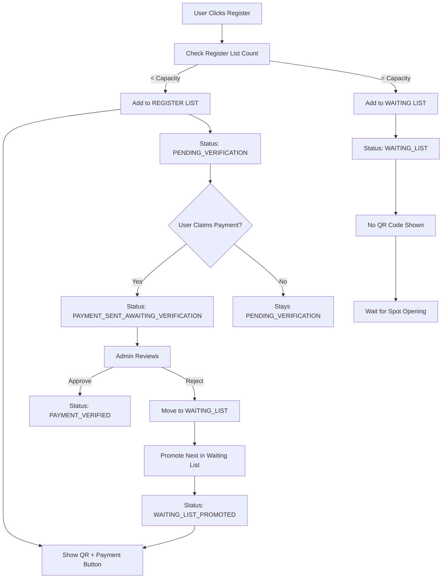

# Registration System Analysis & Implementation Guide

## 📋 Table of Contents

1. [System Overview](#system-overview)
2. [Core Use Cases](#core-use-cases)
3. [Database Schema Requirements](#database-schema-requirements)
4. [Payment Flow Architecture](#payment-flow-architecture)
5. [Status Management](#status-management)
6. [Capacity Management](#capacity-management)
7. [Email & Notification System](#email--notification-system)
8. [Admin Interface Requirements](#admin-interface-requirements)
9. [Edge Cases & Business Rules](#edge-cases--business-rules)
10. [Implementation Priority](#implementation-priority)
11. [Technical Requirements](#technical-requirements)

---

## 🎯 System Overview

The registration system is designed to ensure only users who have actually paid
get confirmed spots, while providing flexibility for admin management and
handling edge cases gracefully. The system operates on a **webpage-centric
experience** with minimal email communication.

### Key Principles

- **Payment-First**: All registrations require payment verification
- **Capacity-Aware**: Proper counting based on payment status
- **Admin-Controlled**: Final verification authority rests with admins
- **User-Friendly**: Clear status visibility and simple payment claiming
- **Flexible**: Supports multiple payment methods and edge cases

---

## 🔄 Core Use Cases

### 1. User Self-Registration

**Actor**: Regular user  
**Preconditions**: User has verified account, event is open for registration  
**Flow**:

1. User clicks "Register" on event page
2. System checks event capacity and registration status
3. If capacity available → Show payment details + QR code on webpage
4. If full → Add to waiting list
5. **NO EMAIL SENT** at this stage

**Business Rules**:

- Only users with verified accounts can register
- Registration requires payment (no free events)
- Payment details displayed directly on webpage
- User must claim payment before taking spot in register list

**Postconditions**: User has `PENDING_VERIFICATION` status, payment details
visible

### 2. Friend Registration

**Actor**: User registering for someone else  
**Preconditions**: User has verified account, event allows friend registration  
**Flow**:

1. User fills friend's name (required) + optional contact info
2. Same payment flow as self-registration
3. Payment details displayed on webpage (no email)
4. Friend appears in registration list with special indicator

**Business Rules**:

- Only name is required for friend
- Friend doesn't need account
- Registering user is responsible for payment
- Friend gets same event access as regular registrant
- Limit number of friends per user (e.g., max 3)

**Postconditions**: Friend registration created with `PENDING_VERIFICATION`
status

### 3. Payment Claiming Process

**Actor**: User who registered  
**Preconditions**: User has `PENDING_VERIFICATION` status  
**Flow**:

1. User sees payment details and QR code on webpage
2. User clicks "I've sent the payment" button on same page
3. Status changes to `PAYMENT_SENT_AWAITING_VERIFICATION`
4. **CONFIRMATION EMAIL SENT** to user
5. Registration now takes spot in capacity count

**Business Rules**:

- Only users with `PENDING_VERIFICATION` status can claim
- Claiming moves user from pending to registered list
- If capacity exceeded during claiming, user moved to waiting list
- **ONLY EMAIL SENT** when user claims payment
- Users can claim payment multiple times (no penalty)

**Postconditions**: User has `PAYMENT_SENT_AWAITING_VERIFICATION` status, spot
reserved

### 4. Admin Payment Verification

**Actor**: Event admin/manager  
**Preconditions**: Admin has verification permissions  
**Flow**:

1. Admin sees list of pending payments
2. Admin checks bank account for payments
3. Admin approves/rejects each payment
4. System sends notifications to users

**Business Rules**:

- Only admins can verify payments
- Rejected payments move user back to pending or waiting list
- Approved payments confirm registration spot
- Cash payments can be marked as `VERIFIED_CASH`
- Bulk operations supported for efficiency

**Postconditions**: Payment status updated, user notified, capacity adjusted

### 5. Waiting List Management

**Actor**: System + Users  
**Preconditions**: Event at capacity, waiting list enabled  
**Flow**:

1. When registration is cancelled → Promote next in waiting list
2. When payment is rejected → Move to waiting list
3. When spot opens → Show payment details on webpage (no email)
4. Promoted users get payment instructions on webpage

**Business Rules**:

- Waiting list is first-come-first-served
- Promoted users see payment details on webpage
- No time limits for payment claiming
- Waiting list doesn't count toward capacity
- Position numbers updated automatically

**Postconditions**: Users moved between lists, capacity maintained

---

## 🗄️ Database Schema Requirements

### New Payment Status Enum

```typescript
enum RegistrationPaymentStatus {
  PENDING_VERIFICATION                    // Doesn't take spot
  PAYMENT_SENT_AWAITING_VERIFICATION     // Takes spot
  PAYMENT_VERIFIED                       // Takes spot (confirmed)
  VERIFIED_CASH                          // Takes spot (cash payment)
  REJECTED                               // Back to pending or waiting list
  WAITING_LIST_PROMOTED                  // New status for promoted users
}
```

### Updated Registration Model

```typescript
model Registration {
  // ... existing fields
  paymentStatus RegistrationPaymentStatus @default(PENDING_VERIFICATION)
  paymentClaimedAt DateTime?
  paymentVerifiedAt DateTime?
  paymentRejectedAt DateTime?
  paymentRejectionReason String?
  paymentMethod PaymentMethod? // BANK_TRANSFER, CASH, etc.

  // Friend registration fields
  friendInfo Json? // Stores friend details
  registeredBy String? // User who registered the friend
}
```

### Payment Model Enhancements

```typescript
model Payment {
  // ... existing fields
  registrationId String? @unique
  qrCodeData String? // Generated QR code string
  qrCodeUrl String? // URL to QR code image
  claimedAt DateTime? // When user claimed payment
  verifiedBy String? // Admin who verified
  verificationNotes String?
}
```

---

## 💳 Payment Flow Architecture

### Registration Flow Diagram



### Capacity Management Logic

```typescript
function getEffectiveRegistrationCount(eventId: string) {
  return registrations.filter((r) =>
    [
      "PAYMENT_SENT_AWAITING_VERIFICATION",
      "PAYMENT_VERIFIED",
      "VERIFIED_CASH",
    ].includes(r.paymentStatus)
  ).length;
}

function hasCapacity(eventId: string) {
  const currentCount = getEffectiveRegistrationCount(eventId);
  const event = getEvent(eventId);
  return currentCount < event.capacity;
}
```

---

## 📊 Status Management

### Status Transition Rules

| Current Status                     | Action              | New Status                         | Takes Spot | Email Sent      |
| ---------------------------------- | ------------------- | ---------------------------------- | ---------- | --------------- |
| PENDING_VERIFICATION               | User claims payment | PAYMENT_SENT_AWAITING_VERIFICATION | ✅ Yes     | ✅ Confirmation |
| PAYMENT_SENT_AWAITING_VERIFICATION | Admin approves      | PAYMENT_VERIFIED                   | ✅ Yes     | ✅ Verification |
| PAYMENT_SENT_AWAITING_VERIFICATION | Admin rejects       | REJECTED                           | ❌ No      | ✅ Rejection    |
| PENDING_VERIFICATION               | Admin cash payment  | VERIFIED_CASH                      | ✅ Yes     | ✅ Verification |
| WAITING_LIST                       | Promoted from list  | WAITING_LIST_PROMOTED              | ❌ No      | ❌ None         |

### Status Descriptions

- **PENDING_VERIFICATION**: User registered, payment details shown, no spot
  taken
- **PAYMENT_SENT_AWAITING_VERIFICATION**: User claimed payment, spot reserved,
  awaiting admin
- **PAYMENT_VERIFIED**: Payment confirmed by admin, spot confirmed
- **VERIFIED_CASH**: Cash payment verified by admin, spot confirmed
- **REJECTED**: Payment rejected, moved to waiting list or back to pending
- **WAITING_LIST_PROMOTED**: Promoted from waiting list, payment details shown

---

## 🎯 Capacity Management

### Registration List vs Waiting List

**Registration List** (Takes spots):

- `PAYMENT_SENT_AWAITING_VERIFICATION`
- `PAYMENT_VERIFIED`
- `VERIFIED_CASH`

**Waiting List** (No spots taken):

- `WAITING_LIST`
- `PENDING_VERIFICATION` (when capacity full)

### Capacity Calculation

```typescript
function calculateCapacity(eventId: string) {
  const event = getEvent(eventId);
  const registeredCount = getEffectiveRegistrationCount(eventId);
  const availableSpots = event.capacity - registeredCount;

  return {
    total: event.capacity,
    registered: registeredCount,
    available: Math.max(0, availableSpots),
    waitingListCount: getWaitingListCount(eventId),
  };
}
```

### Waiting List Promotion Logic

```typescript
async function promoteFromWaitingList(eventId: string) {
  const nextInLine = await getNextWaitingListEntry(eventId);

  if (nextInLine && hasCapacity(eventId)) {
    // Move to registration with WAITING_LIST_PROMOTED status
    await createRegistrationFromWaitingList(nextInLine);

    // Send payment details to webpage (no email)
    await updateUserInterface(nextInLine.userId);

    // Update waiting list positions
    await updateWaitingListPositions(eventId);
  }
}
```

---

## 📧 Email & Notification System

### Email Templates Required

#### 1. Payment Confirmation Email

**Trigger**: User clicks "I've sent payment" button  
**Template**: `payment-confirmation.html`  
**Content**:

- Confirmation that payment claim was received
- Event details and registration confirmation
- Reminder that admin needs to verify payment
- Contact information for questions

#### 2. Payment Rejection Email

**Trigger**: Admin rejects payment  
**Template**: `payment-rejection.html`  
**Content**:

- Reason for rejection
- Instructions to try again
- Contact information for support

#### 3. Payment Verification Email

**Trigger**: Admin approves payment  
**Template**: `payment-verified.html`  
**Content**:

- Confirmation that payment was verified
- Event details and final confirmation
- Next steps for attending event

### Webpage Notifications

#### Registration Page Elements

- Payment details and QR code
- "I've sent payment" button
- Current status indicator
- Waiting list position (if applicable)
- Payment history and claims

#### Admin Dashboard Notifications

- List of pending payments
- Payment details and user information
- Quick approve/reject actions
- Capacity overview

---

## 👥 Admin Interface Requirements

### 1. Payment Verification Dashboard

**Features**:

- View all pending payments with details
- See payment amount, user info, claim date
- Bulk approve/reject operations
- Filter by payment method, date range
- Export payment data

**Actions**:

- Approve payment → Status to `PAYMENT_VERIFIED`
- Reject payment → Status to `REJECTED`
- Mark as cash payment → Status to `VERIFIED_CASH`
- Add verification notes

### 2. Manual User Management

**Features**:

- Add users to registration list (bypass capacity)
- Add users to waiting list
- Move users between lists
- Override payment requirements
- Cancel registrations

**Actions**:

- Manual registration creation
- Payment status override
- Capacity limit bypass
- Bulk user operations

### 3. Event Capacity Management

**Features**:

- Increase/decrease event capacity
- View current registration counts
- See waiting list length
- Export registration data
- Capacity analytics

**Actions**:

- Modify event capacity
- View capacity breakdown
- Generate capacity reports
- Monitor waiting list trends

---

## 🚨 Edge Cases & Business Rules

### 1. No Time Limits

- Users can claim payment anytime
- No auto-expiration of pending payments
- No auto-rejection of unverified payments
- Admin controls all timing

### 2. Payment Method Flexibility

- QR code for bank transfer (primary)
- Manual bank transfer details
- Cash payment on site (admin verified)
- Multiple payment methods per event

### 3. Friend Registration Limits

- Limit number of friends per user (e.g., max 3)
- Prevent abuse of friend registration
- Track who registered whom
- Apply same payment rules to friends

### 4. Capacity Override

- Admins can add users over capacity
- Special cases (VIP, speakers, etc.)
- Requires admin approval and reason
- Track override reasons

### 5. Payment Claiming Flexibility

- Users can claim payment multiple times
- No penalty for claiming without actually paying
- Admin verification is the final authority
- Track claim history

### 6. Waiting List Simplicity

- No email notifications for waiting list
- Promotion happens silently on webpage
- Users check webpage for status updates
- Position numbers update automatically

---

## 🚀 Implementation Priority

### Phase 1: Database Schema Updates (Week 1)

1. Add `RegistrationPaymentStatus` enum
2. Update `Registration` model with payment fields
3. Enhance `Payment` model with verification fields
4. Add friend registration fields
5. Create database migrations

### Phase 2: Core Registration Flow (Week 2)

1. Implement new registration logic
2. Add payment claiming functionality
3. Update capacity management
4. Create payment QR code generation
5. Update registration dashboard

### Phase 3: Admin Interface (Week 3)

1. Build payment verification dashboard
2. Create manual user management
3. Add capacity management tools
4. Implement bulk operations
5. Add admin notifications

### Phase 4: Email System (Week 4)

1. Create email templates
2. Implement email triggers
3. Add email tracking
4. Test email delivery
5. Add email preferences

### Phase 5: Testing & Polish (Week 5)

1. End-to-end testing
2. Edge case testing
3. Performance optimization
4. Security review
5. Documentation updates

---

## 🔧 Technical Requirements

### Frontend Requirements

- React components for payment claiming
- QR code display component
- Status indicator components
- Admin dashboard components
- Real-time status updates

### Backend Requirements

- Payment status management API
- QR code generation service
- Email service integration
- Admin verification API
- Capacity calculation service

### Database Requirements

- Payment status tracking
- Friend registration support
- Audit trail for all changes
- Performance indexes for queries
- Data integrity constraints

### Security Requirements

- Admin role verification
- Payment data encryption
- Audit logging
- Input validation
- CSRF protection

### Performance Requirements

- Fast registration process
- Efficient capacity calculations
- Quick admin dashboard loading
- Scalable email system
- Optimized database queries

---

## 📈 Success Metrics

### User Experience Metrics

- Registration completion rate
- Payment claiming rate
- Time to payment verification
- User satisfaction scores

### Business Metrics

- Payment success rate
- Waiting list conversion rate
- Admin verification efficiency
- Revenue per event

### Technical Metrics

- System response time
- Email delivery rate
- Database query performance
- Error rate monitoring

---

## 🎯 Conclusion

This registration system provides a robust, user-friendly solution that ensures
only verified payments get confirmed spots while maintaining flexibility for
admin management. The webpage-centric approach with minimal email communication
creates a clean user experience while the comprehensive admin tools ensure
proper oversight and control.

The implementation prioritizes:

1. **User Experience**: Clear status visibility and simple payment claiming
2. **Admin Control**: Full verification authority and management tools
3. **System Reliability**: Proper capacity management and error handling
4. **Scalability**: Efficient database design and performance optimization

This system will handle the complex requirements of event registration while
providing a smooth experience for both users and administrators.
